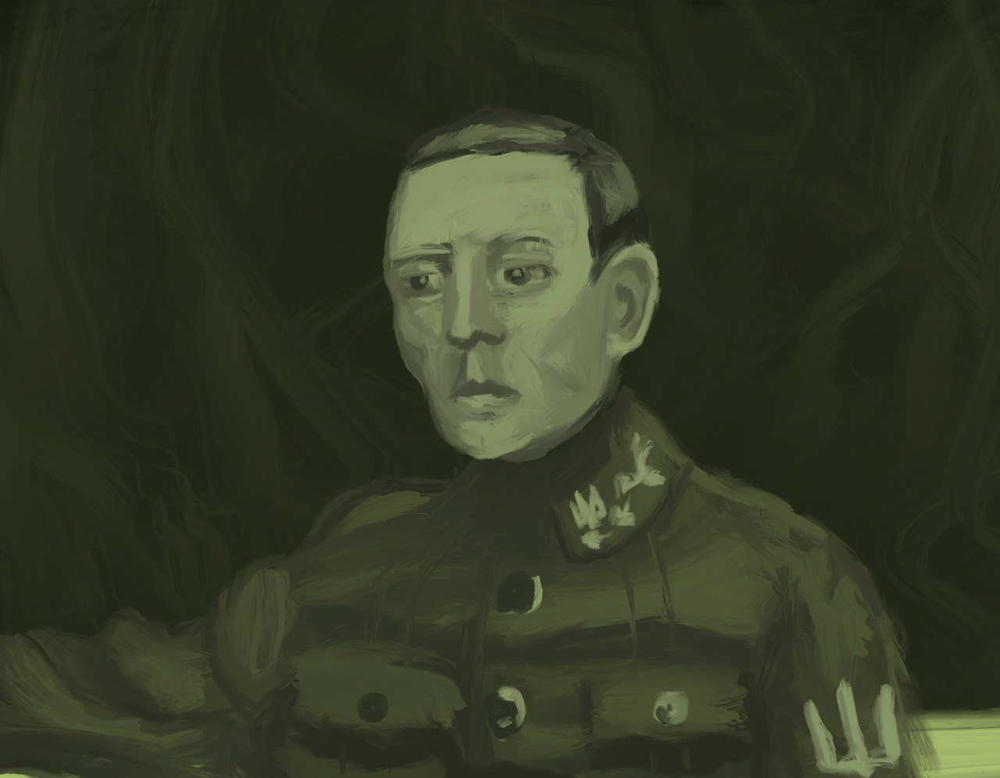

=========
PETLYURYK
=========
Source code for `Petlyuryk <https://t.me/PetlyurykBot>`_ - angry nationalistic bot for Telegram.

	Any resemblance to a person living or dead is purely coincidental. The opinions, beliefs and viewpoints expressed by this bot do not reflect the opinions, beliefs and viewpoints of anybody who participated in making this bot. 

Installation & Development
==========================
All you need to start editing this bot is to have NPM and latest Docker installed locally. `Also you would need a valid Telegram Bot API key <https://core.telegram.org/bots#6-botfather>`_. Then do the following:

- Pull this repository.
- Create an :code:`.env` file in the root of the folder with the following contents::
	
	TELEGRAM_TOKEN=<your bot token>
	MONGO_INITDB_ROOT_USERNAME=<come up with your mongodb username>
	MONGO_INITDB_ROOT_PASSWORD=<come up with your mongodb password>
	OPENWEATHER_TOKEN=<optional: openweather token>

- Run :code:`npm install`.
- Run :code:`npm run docker`.

License
=======
PETLYURYK is licensed under the GPL-3.0 License, what allows you to use it for commercial and non-commercial purposes absolutely for free - but you have to keep this license and disclose source files of your product.
	